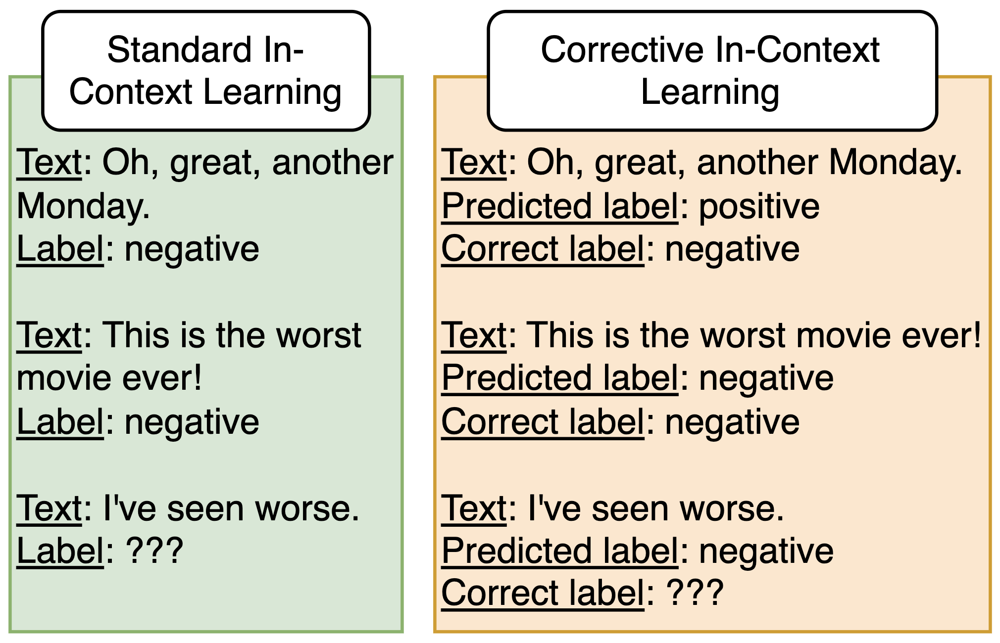

# Corrective In-Context Learning: Evaluating Self-Correction in Large Language Models

This repository contains the code and experiments for the paper "[Corrective In-Context Learning: Evaluating Self-Correction in Large Language Models]()", accepted at the Sixth Workshop on Insights from Negative Results in NLP at NAACL 2025. The work explores a novel corrective approach to standard in-context learning by incorporating self-correction mechanisms in large language models.



## Abstract

With the goal of improving the performance of in-context learning (ICL), we propose *corrective in-context learning* (CICL), an approach that incorporates a model's incorrect predictions alongside ground truth corrections into the prompt, aiming to enhance classification accuracy through self-correction. However, contrary to our hypothesis, extensive experiments on text classification tasks demonstrate that CICL consistently underperforms standard ICL, with performance degrading as the proportion of corrections in the prompt increases. Our findings indicate that CICL introduces confusion by disrupting the model's task understanding, rather than refining its predictions. Additionally, we observe that presenting harder examples in standard ICL does not improve performance, suggesting that example difficulty alone may not be a reliable criterion for effective selection. By presenting these negative results, we provide important insights into the limitations of self-corrective mechanisms in LLMs and offer directions for future research.

## How to Run

To run the code, follow these steps:

1. Clone the repository
```bash
git clone https://github.com/mario-sanz/CICL.git
cd CICL
```

2. Optionally (but recommended), create a virtual environment
```bash
conda create -n cicl python=3.11
conda activate cicl
```

3. Install the requirements
```bash
pip install -r requirements.txt
```

4. Prepare the data: The code expects datasets to be located in the `data/` directory. Ensure you have the required datasets stored as expected (e.g., `data/ag_news`, `data/cr`, etc.).

5. Run the experiments: Execute the main experiment script, which iterates over the different datasets, models, and configurations. The results will be saved as JSON files in the `results/` directory.
```bash
python main.py
```

For any questions or issues, please open an issue on GitHub.

## Citation

If you find this work useful, please consider citing the paper:
```
@article{...,
  title={Corrective In-Context Learning: Evaluating Self-Correction in Large Language Models},
  author={...},
  journal={...},
  year={2025}
}
```